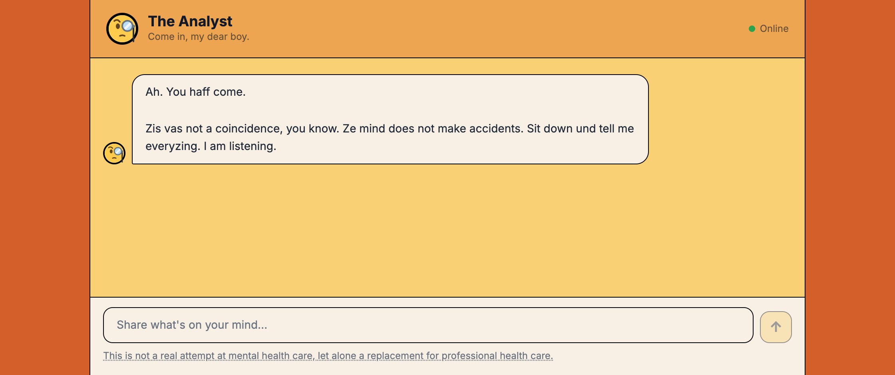

<h1 align="center">🧐 The Analyst</h1>

<p align="center"><em>"Sit. Do not touch anything. You are here because something is… wrong."</em></p>

<p align="center">
  <a href="https://coach.mavi.party"><strong>Live demo →</strong></a>
</p>

A chat application starring a stern, sinister continental psychoanalyst who is
deeply skeptical of your mental health. Unlike most chatbots wearing a costume,
this one has **actually read the books**: every reply is grounded in real
passages retrieved from nine public-domain works of Freud and Jung.



> ⚠️ It is not therapy, it is not advice, and it says so in the footer. It is a
> piece of interactive fiction with a very good reading list.

---

## Run it

You need **two terminals** — a Python backend and a Next.js frontend.

```bash
# Terminal 1 — backend (from the repo root)
export ANTHROPIC_API_KEY=sk-ant-...   # the Analyst's voice
export OPENAI_API_KEY=sk-...          # embeds the query at runtime
uv run uvicorn api.index:app --reload # → http://localhost:8000

# Terminal 2 — frontend
cd frontend
npm install                           # first time only
npm run dev                           # → http://localhost:3000
```

Open <http://localhost:3000>. The frontend proxies `/api/*` to port 8000 in
development, so no extra config — but the backend must be running or every
message will fail.

**Tests need no keys at all.** Every external client is mocked:

```bash
uv run pytest -q          # backend — 66 tests
cd frontend && npm test   # frontend — 16 tests
```

---

## The interesting part: retrieval without a vector database

The Analyst doesn't improvise its theory. Each reply is grounded in real source
text via a hand-rolled RAG layer — no vector DB, no LangChain, just numpy and
**3,807 chunks** of public-domain psychoanalysis.

**Offline (committed to the repo).** `scripts/build_index.py` fetches nine texts
from Project Gutenberg — seven Freud, two Jung — prunes the front and back
matter with per-book regex markers, splits what's left into ~300–500-token
windows with a paragraph of overlap, and embeds each one with OpenAI
`text-embedding-3-small`. The result lands in `api/_index/` as a float16,
row-normalized `embeddings.npy` plus a `chunks.json` of text and provenance.

**Online (per request).** The serverless function embeds exactly one thing: the
query. Cosine similarity is then a plain dot product over a flat matrix —
`argpartition` for the top 4, sub-millisecond at this size — filtered by a
similarity floor so an off-topic question retrieves *nothing* rather than noise.
The winners are appended to the system prompt, which re-asserts the persona and
forbids the Analyst from ever mentioning that he looked anything up.

Three rules keep it honest:

| Rule | Why |
|---|---|
| Same embedding model on both sides | The runtime asserts dimension equality and refuses to compare mismatched vector spaces |
| Never load model weights into the function | Embeddings are precomputed; the function stays small and cold-starts fast |
| Missing index → ungrounded chat, never a 500 | The persona degrades gracefully; the user never sees a stack trace |

Only pre-1929 translations are used (Eder, Brill, Hall, Hinkle, Kuttner, Long).
The Strachey *Standard Edition* is still under copyright and is deliberately
excluded.

### Rebuilding the index

```bash
OPENAI_API_KEY=sk-... uv run python scripts/build_index.py
```

Idempotent — downloaded texts are reused. Embedding is token-budgeted and paced
against a `TPM_LIMIT` (40K, the OpenAI free tier), so a full build takes ~18
minutes; raise it on a paid tier. Pass `--chunks-only` to fetch and chunk
without embedding, which needs no key and is a quick way to confirm the
committed index is still reproducible.

---

## Architecture

| Layer | Stack | Where |
|---|---|---|
| Frontend | Next.js 14 · TypeScript · Tailwind | `frontend/` |
| Backend | FastAPI · Claude `claude-haiku-4-5-20251001` | `api/` |
| Retrieval | numpy cosine over precomputed embeddings | `api/_index/`, `scripts/build_index.py` |
| Deploy | Vercel monorepo | `vercel.json` |

`vercel.json` routes `/api/*` to the Python serverless function and everything
else to the Next.js app, bundling `api/_index/**` into the function.

Both providers are swappable by comment-toggle: paired `EMBEDDING PROVIDER`
blocks in `scripts/build_index.py` and `api/index.py` switch OpenAI ↔ Voyage,
and the chat provider flips the same way in `api/index.py`.

### Environment variables

| Variable | Needed where | Purpose |
|---|---|---|
| `ANTHROPIC_API_KEY` | Vercel + local shell | Chat completions — the Analyst's voice |
| `OPENAI_API_KEY` | Vercel + local shell | Query embeddings at runtime, corpus embeddings at build time |
| `VOYAGE_API_KEY` | Only if you switch to Voyage | Embeddings, both sides |
| `NEXT_PUBLIC_SITE_URL` | Optional | Canonical URL for social cards; falls back to `VERCEL_URL` |

---

## Things that are not the chat box

- **Sessions end.** Twelve exchanges and the Analyst concludes, with a closing
  line so the cutoff lands as narrative rather than a wall. A lockout in
  `localStorage` keeps the office shut until midnight.
- **He leaves his case notes out.** After a session, a very faint line invites
  you to read what he actually wrote about you (`POST /api/notes`). Deliberately
  easy to miss.
- **You can burn your file.** One click clears the patient record.
- **Guards run before any paid call** — history trimmed to 20 messages,
  per-message cap of 2,000 characters, 15 requests per minute per IP.
- **It works with a screen reader and with motion turned off** — completed
  replies are announced through a polite live region, and the typewriter
  collapses to an instant reveal under `prefers-reduced-motion`.

---

## Further reading

| Document | What's in it |
|---|---|
| [`frontend/README.md`](frontend/README.md) | UI internals — palette, avatar system, design constants |
| [`api/README.md`](api/README.md) | Endpoint reference, curl examples, CORS |
| [`CLAUDE.md`](CLAUDE.md) | Decision log — the invariants and *why*, for anyone (human or model) editing this |
| [`docs/vibe-check.md`](docs/vibe-check.md) | The original hands-on evaluation, and the development log that came out of it |
